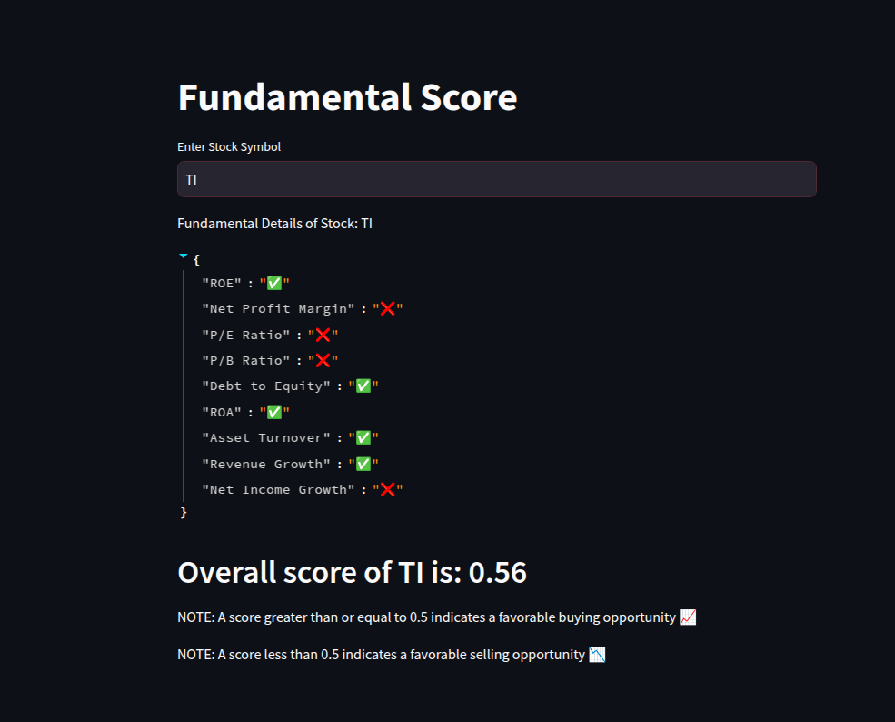

# **📊 Stock Scoring System**  

A **rule and weight-based system** for stock credit scoring that evaluates stocks based on fundamental, technical, risk, and other parameters. The system assigns a **score between 0 and 1**, where:  
✅ **Score ≥ 0.5** → Good for Buying  
❌ **Score < 0.5** → Good for Short Selling  

This project is built using **Streamlit** for the UI and managed with **Poetry** for dependency management.  

---
## **🖼️ UI Preview**  
  


---

## **🚀 How It Works**  
1. **Enter stock symbols** in the UI.  
2. The system fetches stock data and evaluates **fundamental ratios**.  
3. A **credit score** is calculated based on predefined rules and assigned weights.  
4. The UI displays:  
   - **Stock Score**  
   - **Fundamental Ratio (Good/Bad)**  
   - **Buy/Sell Recommendation**  

---

## **📦 Installation & Setup**  

### **1️⃣ Clone the Repository**  
```bash
git clone https://github.com/your-username/credit-scoring.git
cd credit-scoring
```

### **2️⃣ Install Poetry & Dependencies**  
```bash
# Initialize Poetry (if not already initialized)
poetry init  

# Install dependencies from lock file
poetry install  

# If updating dependencies
poetry lock  
```

### **3️⃣ Run the Application**  
```bash
streamlit run main.py
```

---

## **📊 Scoring Methodology**  

| Parameter  | Weight  |
|------------|--------|
| **Fundamental Analysis** | 40% |
| **Technical Indicators** | 30% |
| **Risk Factors** | 20% |
| **Other Factors** | 10% |

The final score is computed using a weighted sum of these factors.  

---

## **🛠️ Technologies Used**  
- **Python** (Data Processing)  
- **Streamlit** (UI)  
- **Poetry** (Dependency Management)  
- **Pandas, NumPy** (Data Handling)  

---

## **📌 Future Improvements**  
- Integrate AI-based scoring  
- Expand fundamental & technical indicators  
- Agentic AI, RAG

---

### **📩 Contributions & Issues**  
Feel free to **open an issue** or **submit a PR** to improve this project! 🚀  
